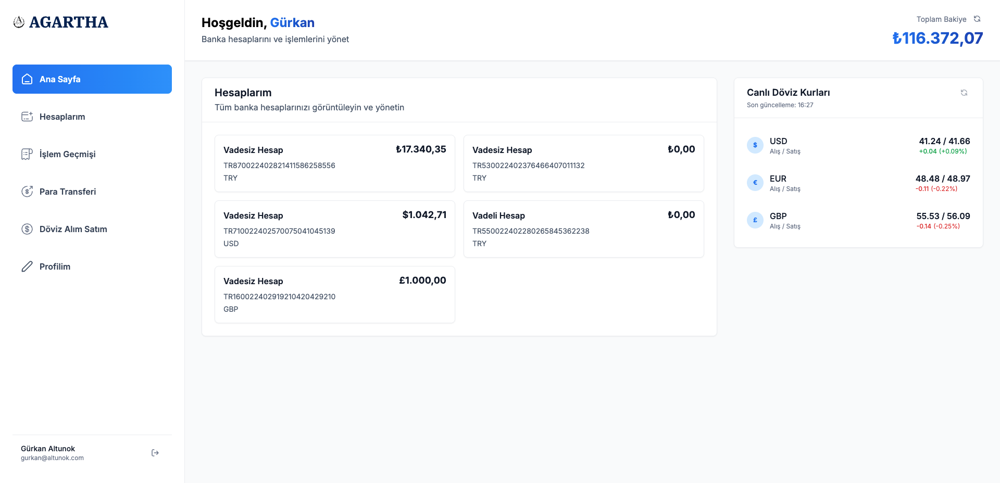
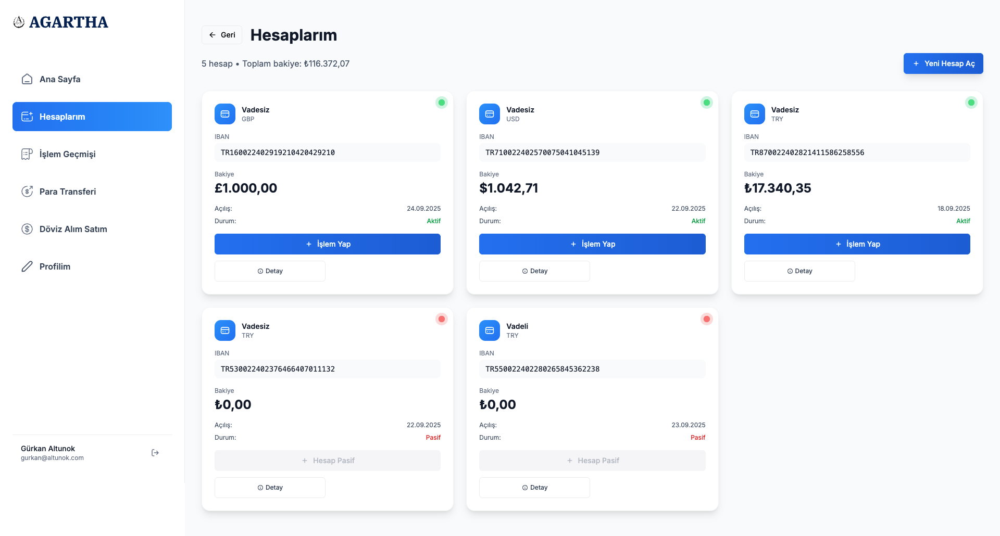
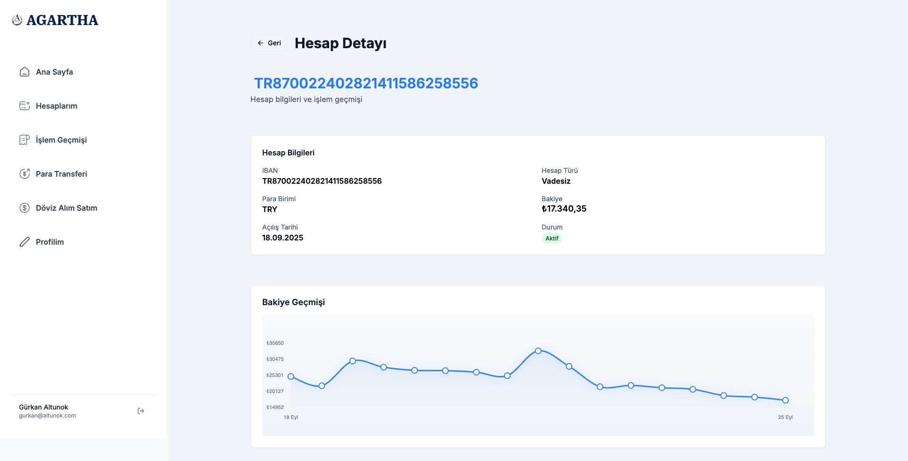
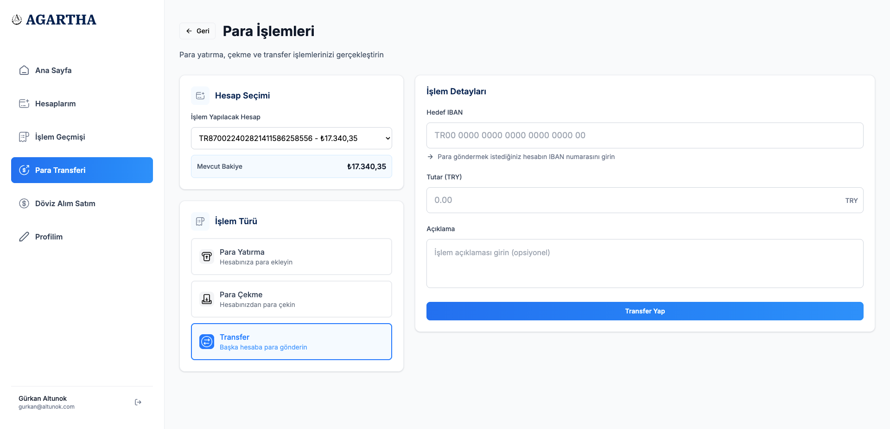
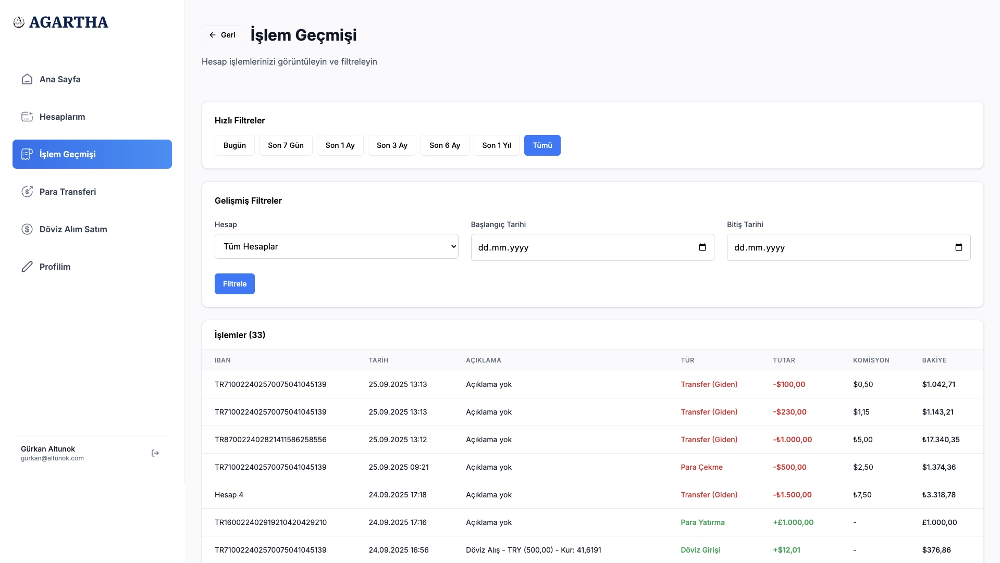
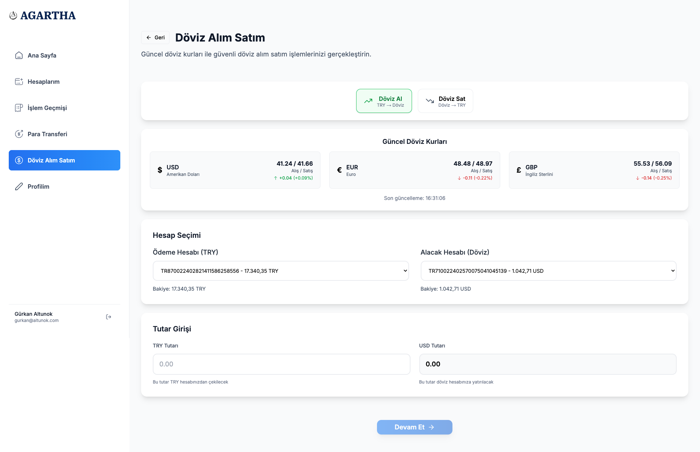
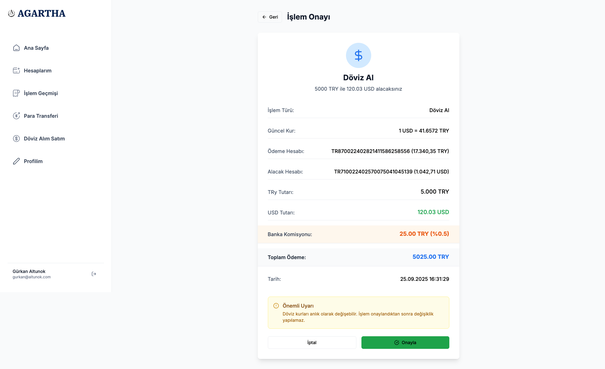
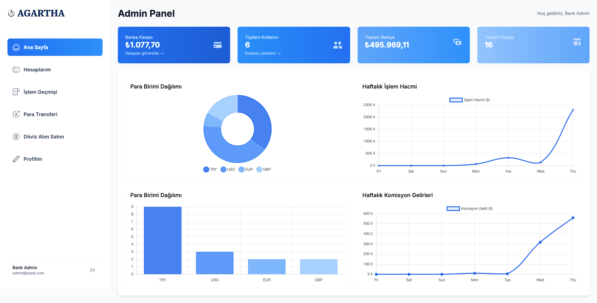

<div align="center">

# BankProject

Full-Stack Banking Demo (ASP.NET Core + Next.js)

[](#)
[](#)
[](#)
[](#license)

<sub>Multi-currency accounts, transactions, FX rates, and admin dashboards.</sub>

</div>

---

## Table of Contents
- [Overview](#overview)
- [Features](#features)
- [Tech Stack](#tech-stack)
- [Architecture](#architecture)
- [Project Structure](#project-structure)
- [Getting Started](#getting-started)
- [Environment](#environment)
- [Scripts](#scripts)
- [Key Endpoints](#key-endpoints)
- [Security Notes](#security-notes)
- [Screenshots](#screenshots)
- [License](#license)

## Overview
A modern multi-currency banking demo featuring authentication, accounts, transactions, FX rates, and admin dashboards. Total balance is calculated on the backend as a single source of truth.

## Features
- 🔐 JWT authentication (login/register/change password)
- 💱 Multi-currency accounts (TRY/USD/EUR/GBP)
- 💸 Transactions: deposit, withdraw, transfer, FX buy/sell
- 📊 Total balance (TRY-based, backend authority)
- 🧾 Balance history (audit trail + charts)
- 📈 Daily FX rates (Frankfurter API)
- 📉 Admin metrics & dashboards
- 🎯 Responsive UI (Next.js, Tailwind, Shadcn UI)

## Tech Stack
- Backend: ASP.NET Core (.NET 8), Entity Framework Core, SQL Server, JWT
- Frontend: Next.js 14, React 18, TypeScript, TailwindCSS, Shadcn UI, Chart.js/Recharts

## Architecture
- Layered: API (Controllers) → Business (Services) → DataAccess (EF/Repositories) → Entities
- Enums: `CurrencyType`, `AccountType`, `TransactionType`
- Tables: `Users`, `Roles`, `Accounts`, `Transactions`, `BalanceHistories`, `Addresses`, `ExchangeRates`
- Indexes: `Accounts.IBAN (unique)`, `ExchangeRates.Date (unique)`
- Note: `Transaction.BalanceAfter` = quick snapshot; `BalanceHistories` = detailed time-series/audit

## Project Structure
```
BankProject2/
  BankProject.API/            # ASP.NET Core API (Swagger enabled)
  BankProject.Business/       # Services, DTOs
  BankProject.DataAccess/     # Repositories, DbContext, Migrations
  BankProject.Entities/       # Entities & Enums
  bank-app/                   # Next.js frontend
```

## Getting Started
Prereqs: Node.js 18+, npm; .NET SDK 8; SQL Server (local/Docker)

### 1) Database
Edit `BankProject.API/appsettings.json` → `ConnectionStrings:DefaultConnection`

Apply EF migrations:
```bash
# optional: dotnet tool install --global dotnet-ef
dotnet restore && dotnet build
# create/update DB
dotnet ef database update --project BankProject.DataAccess --startup-project BankProject.API
```

### 2) Backend (API)
```bash
dotnet run --project BankProject.API --launch-profile http
# API:     http://localhost:5020
# Swagger: http://localhost:5020/swagger
```

### 3) Frontend (Next.js)
```bash
cd bank-app
npm install
NEXT_PUBLIC_API_URL=http://localhost:5020/api npm run dev
# Frontend: http://localhost:3000
```

## Environment
- Backend: set connection string in `BankProject.API/appsettings.json`
- Frontend: `NEXT_PUBLIC_API_URL` must point to your API base (e.g., `http://localhost:5020/api`)

## Scripts
```bash
# Backend
dotnet restore && dotnet build
dotnet ef database update --project BankProject.DataAccess --startup-project BankProject.API
dotnet run --project BankProject.API --launch-profile http

# Frontend
cd bank-app
npm install
NEXT_PUBLIC_API_URL=http://localhost:5020/api npm run dev
```

## Key Endpoints
- Auth: `POST /api/auth/login`, `POST /api/auth/register`, `POST /api/auth/change-password`
- Users: `GET /api/users/me` (includes `registerDate`), `PUT /api/users/update`
- Accounts: `GET /api/accounts/my-accounts`, `GET /api/accounts/my-total-balance`, `POST /api/accounts`, `DELETE /api/accounts/{id}`
- Transactions: `POST /api/transactions/deposit|withdraw|transfer`, `POST /api/transactions/exchange-buy|exchange-sell`
- Admin/FX: `GET /api/admin/dashboard`, `GET /api/admin/daily-transaction-volume`, `GET /api/admin/daily-commission-revenue`

## Security Notes
- JWT Bearer + [Authorize]
- Server-side ownership checks (prevent IDOR)
- Dev CORS relaxed; restrict in production
- Recommended: HTTPS, rate limiting, centralized logging/telemetry

## Screenshots
All images live under `docs/screenshots/`. Below is a structured gallery.

### Overview
| Homepage | My Banks |
|---|---|
|  |  |

### Banking
| Account | Payment / Transfer | Transaction History |
|---|---|---|
|  |  |  |

### Exchange
| Trading | Confirm |
|---|---|
|  |  |

### Admin
| Admin Panel |
|---|
|  |

## License
MIT

---

<details>
<summary><strong>🇹🇷 Türkçe Açıklama</strong></summary>

## Genel Bakış
Kimlik doğrulama, hesap yönetimi, para transferleri, döviz işlemleri, kur yönetimi ve yönetim paneli içeren modern ve çok para birimli bankacılık demosu. Toplam bakiye tek doğru kaynak olması için backend’te TRY bazlı hesaplanır.

## Özellikler
- 🔐 JWT kimlik doğrulama (giriş/kayıt/şifre değiştir)
- 💱 Çoklu para birimi: TRY/USD/EUR/GBP
- 💸 İşlemler: para yatır/çek, havale/eft/transfer, döviz al/sat
- 📊 Toplam bakiye (TRY bazlı; backend otoritesi)
- 🧾 Bakiye geçmişi (audit trail) ve grafikler
- 📈 Günlük kur verileri (Frankfurter API) ve DB’de saklama
- 📉 Admin metrikleri ve gösterge panelleri
- 🎯 Responsive UI (Next.js, Tailwind, Shadcn UI)

## Teknoloji Yığını
- Backend: ASP.NET Core (.NET 8), Entity Framework Core, SQL Server, JWT
- Frontend: Next.js 14, React 18, TypeScript, TailwindCSS, Shadcn UI, Chart.js/Recharts

## Mimari
- Katmanlı yapı: API (Controllers) → Business (Services) → DataAccess (EF/Repositories) → Entities
- Enum’lar: `CurrencyType`, `AccountType`, `TransactionType`
- Tablolar: `Users`, `Roles`, `Accounts`, `Transactions`, `BalanceHistories`, `Addresses`, `ExchangeRates`
- İndeksler: `Accounts.IBAN (unique)`, `ExchangeRates.Date (unique)`
- Not: `Transaction.BalanceAfter` hızlı snapshot; `BalanceHistories` detaylı zaman serisi/audit

## Proje Yapısı
```
BankProject2/
  BankProject.API/            # ASP.NET Core API (Swagger açık)
  BankProject.Business/       # Servisler, DTO’lar
  BankProject.DataAccess/     # Repository’ler, DbContext, Migrations
  BankProject.Entities/       # Entity ve Enum’lar
  bank-app/                   # Next.js frontend
```

## Başlarken
Ön koşullar: Node.js 18+, npm; .NET SDK 8; SQL Server (lokal/Docker)

### 1) Veritabanı
`BankProject.API/appsettings.json` içinde `ConnectionStrings:DefaultConnection` ayarlayın. EF migration’ları uygulayın:
```bash
# (gerekirse) dotnet tool install --global dotnet-ef
dotnet restore && dotnet build
dotnet ef database update --project BankProject.DataAccess --startup-project BankProject.API
```

### 2) Backend (API)
```bash
dotnet run --project BankProject.API --launch-profile http
# API:     http://localhost:5020
# Swagger: http://localhost:5020/swagger
```

### 3) Frontend (Next.js)
```bash
cd bank-app
npm install
NEXT_PUBLIC_API_URL=http://localhost:5020/api npm run dev
# Frontend: http://localhost:3000
```

## Ortam Değişkenleri
- Backend: `appsettings.json` bağlantı dizesi
- Frontend: `NEXT_PUBLIC_API_URL` (örn. `http://localhost:5020/api`)

## Komutlar (Kısa Yol)
```bash
# Backend
dotnet restore && dotnet build
dotnet ef database update --project BankProject.DataAccess --startup-project BankProject.API
dotnet run --project BankProject.API --launch-profile http

# Frontend
cd bank-app
npm install
NEXT_PUBLIC_API_URL=http://localhost:5020/api npm run dev
```

## Önemli Uçlar
- Auth: `POST /api/auth/login`, `POST /api/auth/register`, `POST /api/auth/change-password`
- Users: `GET /api/users/me` (registerDate içerir), `PUT /api/users/update`
- Accounts: `GET /api/accounts/my-accounts`, `GET /api/accounts/my-total-balance`, `POST /api/accounts`, `DELETE /api/accounts/{id}`
- Transactions: `POST /api/transactions/deposit|withdraw|transfer`, `POST /api/transactions/exchange-buy|exchange-sell`
- Admin/FX: `GET /api/admin/dashboard`, `GET /api/admin/daily-transaction-volume`, `GET /api/admin/daily-commission-revenue`

## Güvenlik Notları
- JWT + [Authorize]
- Sunucu tarafı sahiplik kontrolleri (IDOR’a karşı)
- Geliştirmede CORS esnek; prod’da domain bazlı kısıtlayın
- Öneri: HTTPS zorunlu, rate limiting, merkezi log/telemetri

## Ekran Görüntüleri
Görseller `docs/screenshots/` altında. README üst bölümünde düzenli grid olarak listelenmiştir.

## Lisans
MIT

</details>
